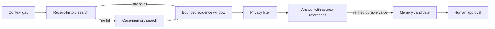

# Agent Memory Recall

> A sanitized, Markdown-only skill for evidence-first context recovery in long-running agent workflows.

[简体中文](./README.zh-CN.md) · [Skill specification](./SKILL.md) · [Public boundary](./references/privacy-boundary.md)

Agents often face short references such as “continue the previous one” or “this failed again.” The safe response is not to invent continuity or load every historical record. This skill defines a bounded recall workflow that searches recent, redacted evidence first and treats retrieved history as temporary context—not automatically as durable memory.



## What it demonstrates

- Proactive detection of context gaps
- Grep-first retrieval over lightweight, redacted indexes
- Recent-session-first search with explicit stopping conditions
- Separation of temporary evidence, durable user memory, successful cases, and shared project knowledge
- Provenance and success-evidence requirements
- Controlled promotion instead of automatic rule mutation

## Repository contents

```text
SKILL.md
README.md
README.zh-CN.md
references/
  memory-layering.md
  recall-policy.md
  privacy-boundary.md
```

## Disclosure

This is an independently rewritten portfolio artifact. It contains no source code, internal names, production paths, logs, user records, prompts, operational thresholds, credentials, or proprietary configuration. The implementation remains private.

## License

Documentation: CC BY-NC-ND 4.0. Employer and third-party rights are reserved.
