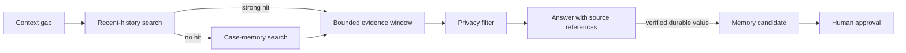
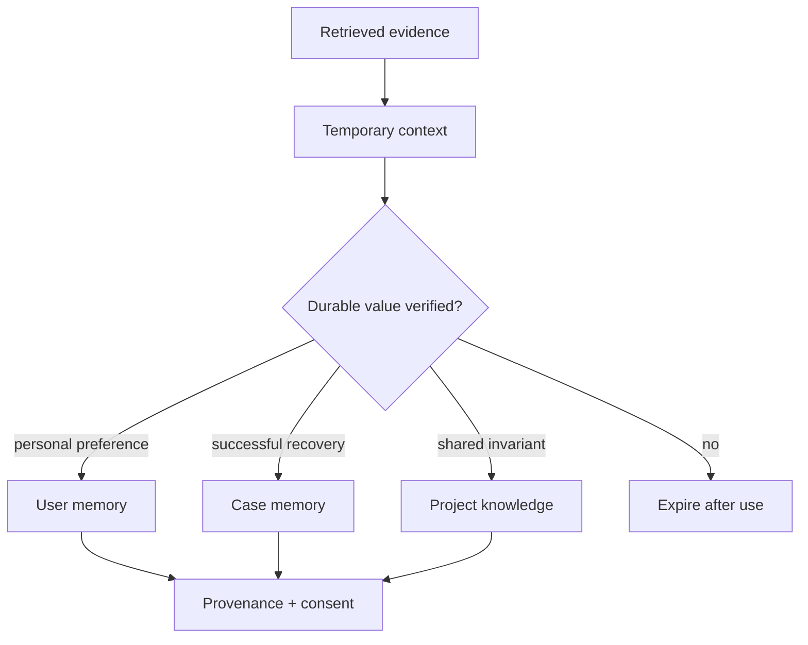
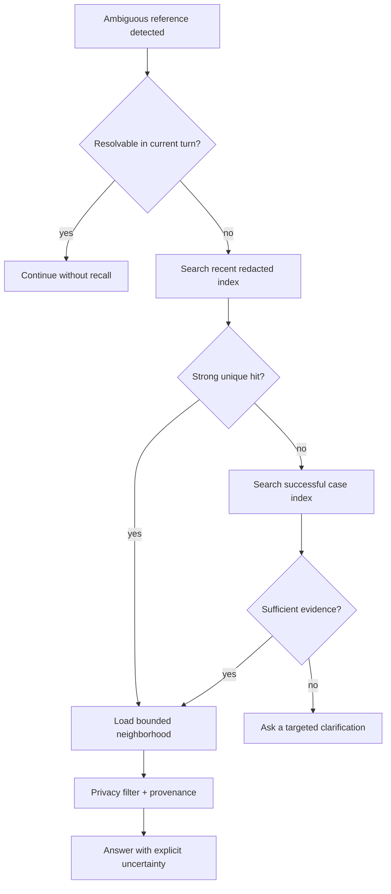

# Agent Memory Recall

> A sanitized, Markdown-only skill for evidence-first context recovery in long-running agent workflows.

[简体中文](./README.zh-CN.md) · [Skill specification](./SKILL.md) · [Public boundary](./references/privacy-boundary.md)

Agents often face short references such as “continue the previous one” or “this failed again.” The safe response is not to invent continuity or load every historical record. This skill defines a bounded recall workflow that searches recent, redacted evidence first and treats retrieved history as temporary context—not automatically as durable memory.

## Innovation focus

1. **Gap-triggered recall** — retrieval starts only when the current context cannot resolve a reference, rather than loading memory on every turn.
2. **Search before synthesis** — lightweight deterministic search narrows the evidence window before any model summarizes it.
3. **Promotion with provenance** — recalled evidence remains temporary until repeated value, source integrity, privacy, and human intent justify durable storage.



## What it demonstrates

- Proactive detection of context gaps
- Grep-first retrieval over lightweight, redacted indexes
- Recent-session-first search with explicit stopping conditions
- Separation of temporary evidence, durable user memory, successful cases, and shared project knowledge
- Provenance and success-evidence requirements
- Controlled promotion instead of automatic rule mutation

## Memory is not one bucket



The destination depends on ownership and reuse scope. A useful fact is not automatically a global rule.

## Recall decision tree



## Stopping conditions

- Stop when one recent hit uniquely resolves the reference.
- Stop when additional history would not change the next action.
- Ask instead of widening when several candidates remain equally plausible.
- Never cross an ownership or privacy boundary merely to reduce uncertainty.

## Synthetic example

**User:** “Continue the evaluation issue from last time.”

The agent searches a redacted recent-session index for `evaluation`, finds one successful thread, loads only the nearby events, and identifies that the unresolved item was a missing negative test. It cites the recovered source and continues. It does not store the entire conversation as memory.

## Quality checks

| Check | Passing condition |
| --- | --- |
| Retrieval precision | Loaded events resolve the current reference |
| Window minimality | Removing unrelated events does not change the answer |
| Provenance | Each recalled claim points to a source record |
| Privacy | No secret, identity, or private payload crosses scope |
| Promotion safety | Durable memory has a clear owner and verified reuse value |
| Failure honesty | Insufficient evidence leads to clarification, not invention |

## Repository contents

```text
SKILL.md
README.md
README.zh-CN.md
references/
  memory-layering.md
  recall-policy.md
  privacy-boundary.md
```

## Disclosure

This is an independently rewritten portfolio artifact. It contains no source code, internal names, production paths, logs, user records, prompts, operational thresholds, credentials, or proprietary configuration. The implementation remains private.

## License

Documentation: CC BY-NC-ND 4.0. Employer and third-party rights are reserved.
