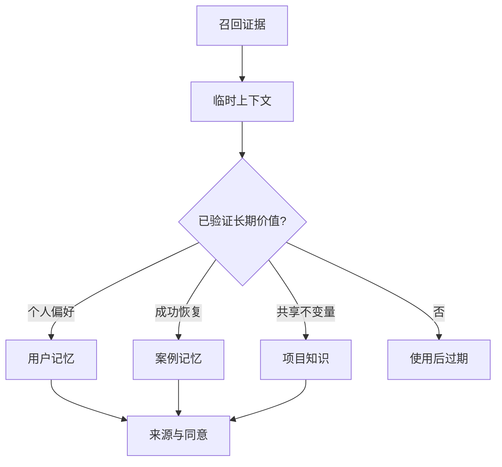
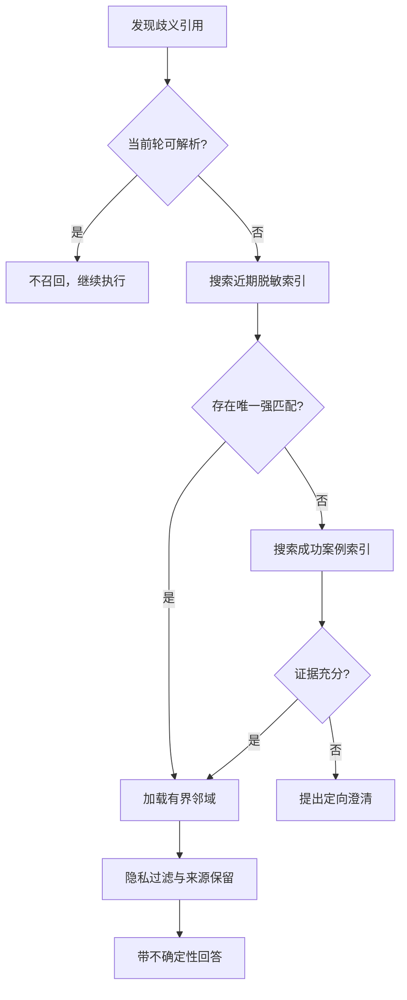

# Agent Memory Recall

[English](./README.md) · [Skill 规范](./SKILL.md) · [公开边界](./references/privacy-boundary.md)

这是一个面向长程 Agent 工作流的、经过脱敏的纯 Markdown 记忆召回 Skill。

当用户说“继续上次那个”“还是这个问题”时，Agent 不应编造连续性，也不应无边界加载全部历史。本 Skill 先在近期、脱敏的轻量索引中进行确定性检索；只有近期证据不足时，才查询成功案例记忆。召回结果首先是临时证据，不能自动升级为长期记忆或项目规则。

## 创新焦点

1. **缺口触发召回**：只有当前上下文无法解析引用时才检索，而不是每轮都加载记忆。
2. **先搜索、后综合**：用轻量确定性检索缩小证据窗口，再交给模型组织结论。
3. **带来源的受控升级**：召回内容先作为临时证据，只有复用价值、来源、隐私与用户意图均满足时才进入长期层。

## 核心能力

- 主动识别上下文缺口
- 使用 grep 类检索缩小证据范围
- 近期会话优先，并设置快速停止条件
- 区分临时上下文、用户长期记忆、成功案例和项目共享知识
- 要求来源引用与成功证据
- 通过候选和人工审查控制知识升级

## 记忆不是一个桶

## 召回决策树

## 停止条件

- 一个近期结果已唯一解析引用时停止。
- 更多历史不会改变下一步动作时停止。
- 多个候选同样可能时，优先澄清而不是无限扩搜。
- 不为降低不确定性而跨越归属或隐私边界。

## 合成示例

用户说：“继续上次那个评测问题。”Agent 在近期脱敏索引中检索 `evaluation`，只加载唯一命中的相邻事件，确认未完成项是缺少负向测试，并引用来源后继续；它不会把整段对话写入长期记忆。

## 质量检查

| 检查项 | 通过标准 |
| --- | --- |
| 检索精度 | 加载事件能够解析当前引用 |
| 窗口最小性 | 去掉无关事件不改变结论 |
| 来源完整性 | 每个召回结论都能指向来源 |
| 隐私 | 无密钥、身份或私有载荷跨越范围 |
| 升级安全 | 长期记忆具有明确归属和复用价值 |
| 失败诚实 | 证据不足时澄清，而不是编造 |

## 仓库导航

- [Skill 规范](./SKILL.md)
- [记忆分层](./references/memory-layering.md)
- [召回策略](./references/recall-policy.md)
- [隐私边界](./references/privacy-boundary.md)

## 公开说明

本仓库为独立重写的作品集材料，不包含源代码、内部名称、生产路径、真实日志、用户记录、Prompt、运行阈值、凭据或专有配置。实现部分保持私有。
